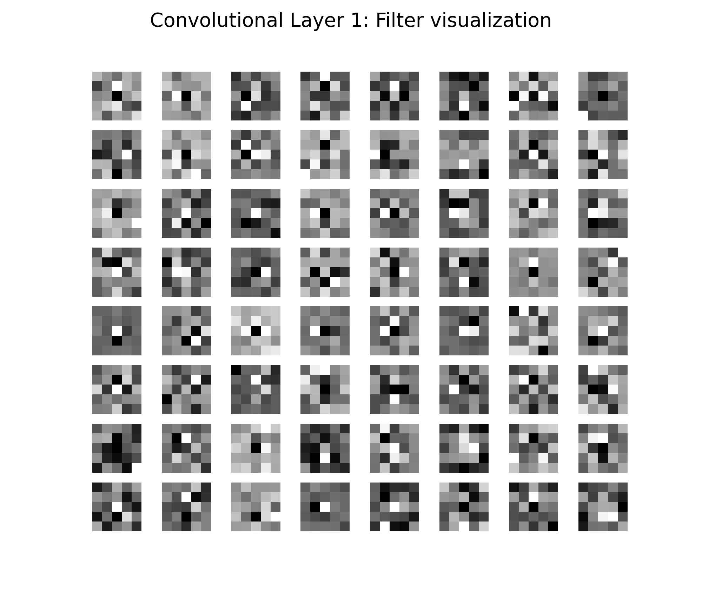
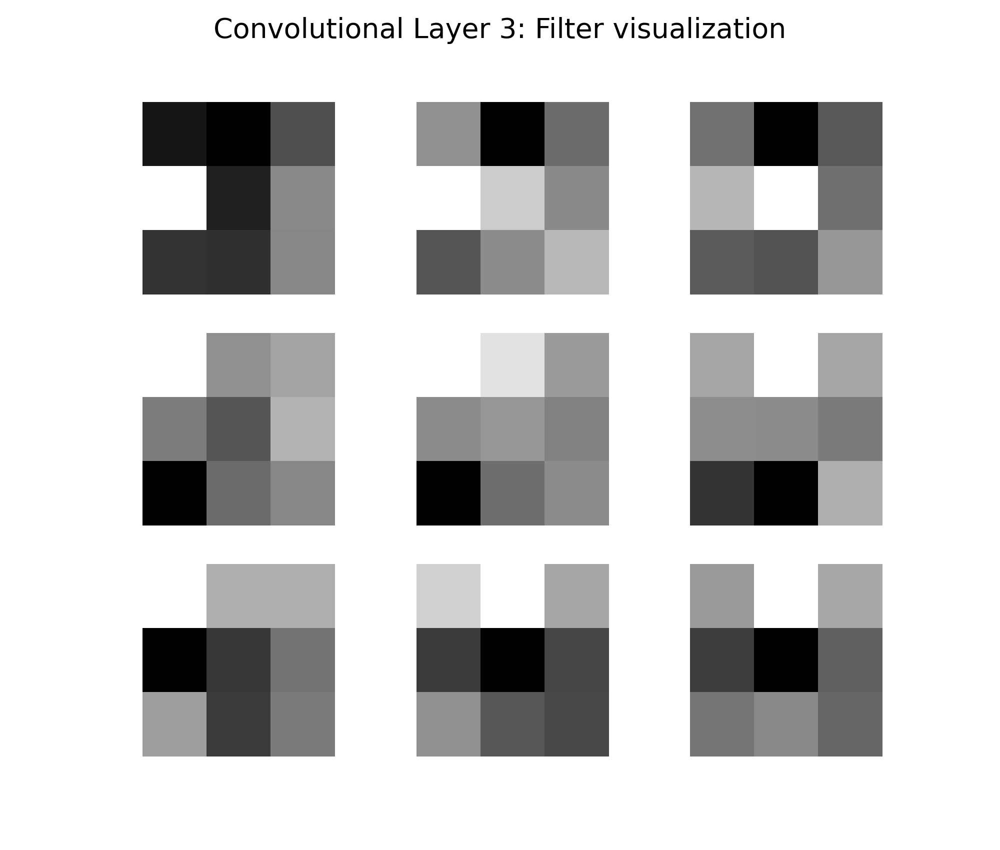

# ESPCN-PyTorch

This repository is implementation of the ["Real-Time Single Image and Video Super-Resolution Using an Efficient Sub-Pixel Convolutional Neural Network"](https://arxiv.org/abs/1609.05158). It was implemented in Python3, and trained/tested on a CPU. This was possible due to the relatively low computational cost compared to other super-resolution CNN's. 

In simple terms, this neural network increases the resolution of images/videos while preserving the Peak Signal to Noise Ratio (PSNR) as much as possible. Although this is training capable, pre-trained weights are provided for immediate use. Details about usage, datasets, results etc are given below.
<center></center>

## Table of Contents
1. [Installation](##1.-installation)
2. [Usage](##2.-usage)
    2.1 [Training/Testing](###2.1-training/testing)
    2.2 [Filter visualization](###2.2-filter-visualization)
    2.3 [Weights](###2.3-weights)
    2.4 [Datasets](###2.4-datasets)
3. [Results](##3.-results)
    3.1 [Image Testing](###3.1-image-testing)
    3.1 [Video Testing](###3.1-video-testing)
    
## 1. Installation
To clone and install the requirements, run the following commands in your target directory.

```bash
git clone https://github.com/jeetyadav98/ESPCN-PyTorch.git
cd ESPCN-PyTorch
pip3 install -r requirements.txt
```

## 2. Usage
All usage can be done through ```main.py```, with the exception of ```prepare.py```(used to prepare datasets for training). For more information on ```prepare.py```, look in the [datasets](###datasets) section. Apart from these two files, all code resides in the ```source/``` directory. 

Run ```python3 main.py --help``` for the description for all command line arguments. These act as boolean toggles which control which operation is supposed to run, while the configuration values are obtained from a yaml file (for easy repetitive use). The default yaml file is ```config.yaml```, although you can provide a path to another one, which enables running multiple configurations at once.

The config file is a nested dictionary for easy editing and maintenance. Run the following to print the contents to the console for inspection. Each sub dictionary corresponds to only one operation.
```bash
~python3 main.py --print-config
```
```
training:
  training file: 'data/datasets/91-image_x3.h5'
  eval file: 'data/datasets/Set5_x3.h5'
  output dir: 'data/weights'

  scale: 3
  lr: 1e-3
  batch size: 16
  number of epochs: 200
  number of workers: 8
  seed: 123

test image:
  weights file: 'data/weights/x3/best.pth'
  scale: 3
  image dir: 'data/images'
  image file: 'baboon.bmp'
  
test video:
  weights file: 'data/weights/x3/best.pth'
  scale: 3
  video dir: 'data/xiph-videos'
  video file: 'bus_cif.avi'

visualize filters:
  weights file: 'data/weights/x3/best.pth'
  scale: 3
```

### 2.1 Training/Testing
Configuration values for Training, Testing Images, Testing Videos are taken from ```config.yaml``` as shown above. 

```python3 main.py --train```
The model is trained using the train and eval datasets. Both are required to be in .h5 format. These datasets, as well as usage of ```prepare.py``` on making custom datasets is given [here](###2.4-datasets).

```python3 main.py --test-image```
The above command processes a singular image whose location is mentioned in the configuration file. ```--batch``` and ```--plot``` can additionally be given as arguments to process an entire directory, and plot the psnr values of all the processed images, respectively. The outputs are stored in an adjacent directory.

```python3 main.py --test-video```
Similar usage to image testing. The ```--plot``` option instead plots over all the frames in a single video. If used in combination with ```--batch```, one plot per video is generated, which is saved in the output directory.

### 2.2 Filter Visualization
Filters for each convolutional layer can be visualized by passing the ```--filters-vis``` argument. This plots and saves the visuals in ```data/visualize_filters```.
<table>
    <tr>
        <td>
            <center></center>
        </td>
        <td>
            <center></center>
        </td>
    </tr>
</table>

### 2.3 Weights
Pre-trained weights can be downloaded from the [here](https://www.dropbox.com/s/2fl5jz5nw9oiw1f/espcn_x3.pth?dl=0). After downloading, simply specify their path in the configuration file for usage.

### 2.4 Datasets

The 91-image, Set5 dataset converted to HDF5 can be downloaded from the links below. [Timofte](https://data.vision.ee.ethz.ch/cvl/DIV2K/) (DIV2K) dataset was used for image testing, and [Xiph](https://media.xiph.org) was used for video testing. Results shown [here](##3-results).

| Dataset | Scale | Type | Link |
|---------|-------|------|------|
| 91-image | 3 | Train | [Download](https://www.dropbox.com/s/4mv1v4qfjo17zg3/91-image_x3.h5?dl=0) |
| Set5 | 3 | Eval | [Download](https://www.dropbox.com/s/9qlb94in1iqh6nf/Set5_x3.h5?dl=0) |

## 3. Results
### 3.1 Image testing
The [Timofte](https://data.vision.ee.ethz.ch/cvl/DIV2K/) HR eval dataset (100 images) was used for testing. The following graph shows PSNR vs image number, along with average PSNR. Note that the variability in PSNR is due to the vastly different nature of the images.
<center></center>
Shown below are results for a few sample images which demonstrate better performance versus simple bicubic interpolation.

<table>
    <tr>
        <td><center>Original</center></td>
        <td><center>BICUBIC x3</center></td>
        <td><center>ESPCN x3</center></td>
    </tr>
    <tr>
    	<td>
    		<center></center>
    	</td>
    	<td>
    		<center></center>
    	</td>
    	<td>
    		<center></center>
    	</td>
    </tr>
    <tr>
        <td><center>Original</center></td>
        <td><center>BICUBIC x3</center></td>
        <td><center>ESPCN x3</center></td>
    </tr>
    <tr>
    	<td>
    		<center></center>
    	</td>
    	<td>
    		<center></center>
    	</td>
    	<td>
    		<center></center>
    	</td>
    </tr> 
    <tr>
        <td><center>Original</center></td>
        <td><center>BICUBIC x3</center></td>
        <td><center>ESPCN x3</center></td>
    </tr>
    <tr>
    	<td>
    		<center></center>
    	</td>
    	<td>
    		<center></center>
    	</td>
    	<td>
    		<center></center>
    	</td>
    </tr>  
</table>

### 3.2 Video Testing
[Xiph](https://media.xiph.org) datasets were used to test videos. These are processed frame by frame in a similar manner to images. Shown below is the PSNR plot for a sample video from that dataset.
<center></center>

